# Сетевые операции

`RXNetworkOperation` - мощный инструмент, который выполняет `http`запросы в несколько строчек кода.<br>

Библиотека представляет собой несколько подклассов `NSOperation`, которые содержат массивный пласт логики осуществляющий соединения с интернетом.<br>Главным приемуществом технологии по мимо легкости использования, является потрясающая лаконичность.<br>

Сравнивая с имеющимися решениями на рынке `iOS`/`OS X` разработки, используя `RXNO`, в некоторых отдельных случаях вам потребуется написать **в десятки раз меньше кода**, чем если вы будете использовать традиционные подходы.

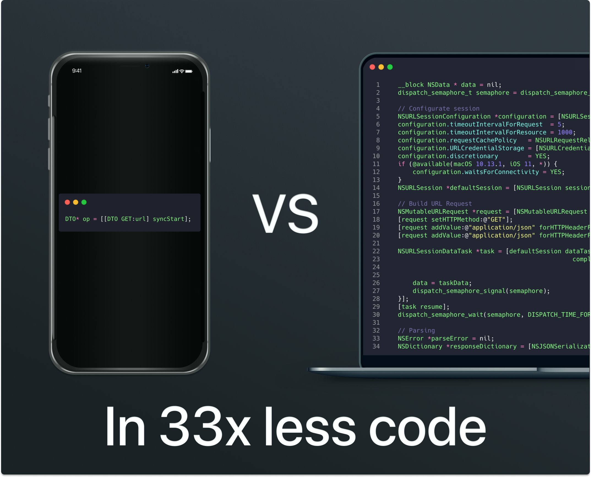

# Содержание

- [Причина создания RXNetworkOperation](#paragraph1)

- [Описание операций](#paragraph2)

- [Методы управления операциями](#paragraph3)

- [Способы взаимодействия с операциями](#paragraph4)

- [Состояние операций](#paragraph5)

- [Примеры использования](#paragraph6)
  
  - [Демонстрация работы класса DTO](#paragraph7)
    - [Загрузка json](#paragraph8)
    - [Загрузка изображения](#paragraph9)
  - [Демонстрация работы класса UO](#paragraph10)
    - [Выгрузка через NSDictionary](#paragraph11)
    - [Выгрузка через NSData](#paragraph12)
    - [Выгрузка через NSURL](#paragraph13)
  - [Демонстрация работы класса DO](#paragraph14)
    - [Загрузка файла и запись на диск](#paragraph15)
    - [Загрузка файла на приватной сессии](#paragraph16)

- [DefaultSession / PrivateSession](#paragraph17)

- [Синхронное выполнение](#paragraph18)

- [Ограничения по времени](#paragraph19)

- [Методы описывающие состояния операции](#paragraph20)

- [Приостановка и возобновление операций](#paragraph21)

- [Отмена запланированных операций](#paragraph22)

- [Отложенные операции](#paragraph23)

- [Групповые операции](#paragraph24)

- [Result и resultClass](#paragraph25)

- [Плюсы](#paragraph26)

- [Features](#paragraph27)

- [Рекомендации](#paragraph28)

- [Дополнительно](#paragraph29)

- [Автор](#paragraph30)

<br>

## Причина создания RXNetworkOperation <a name="paragraph1"></a>

`RXNetworkOperation` был создан для того, чтобы иметь возможность совершать `http-запросы` и не иметь при этом большого количества импортированных зависимостей.<br>

Вам больше не понадобятся разные `AFNetworking` /`Alamofire`, вам больше не нужно будет становиться делегатом `NSURLSession` и реализовывать одни и те же методы в каждом контроллере.<br>

Просто импортируйте `#import <RXNetworkOperation/RXNetworkOperation.h>` и совершайте запросы мгновенно. <br>Также вы почувствуете полную власть над сетевыми операциями, которые вы можете остановить и возобновить в любой момент.<br>
<br>

## Описание операций <a name="paragraph2"></a>

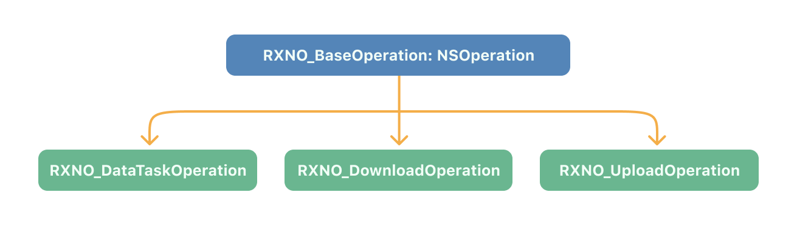

Библиотека предоставляем вам на выбор несколько типов операций.  
Вам нужно будет выбрать один из них конкретно для вашей ситуации.

| Имя класса               | Сокращенное название | Функциональная обязанность                                                                                                                                                                                                                                             |
| ------------------------ | -------------------- | ---------------------------------------------------------------------------------------------------------------------------------------------------------------------------------------------------------------------------------------------------------------------- |
| `RXNO_DataTaskOperation` | **DTO**              | Загружает данные без записи на диск.<br/>Выгружает данные на сервер.<br/><br/>Это универсальный и наиболее часто используемый класс.<br/>Широко используется для большинства повседневных задач, получения `json`, загрузки изображений, выгрузки данных.<br/>         |
| `RXNO_DownloadOperation` | **DO**               | Загружает данные и записывает их на диск в виде отдельного файла.                                                                                                                                                                                                      |
| `RXNO_UploadOperation`   | **UO**               | Предназначен для загрузки данных на сервер, в отличие от `DTO`  имеет отличительную способность загружать данные, расположенные на диске устройства (без предварительного преобразования их в `NSData`), для этого принимает локальный `NSURL` в качестве параметров . |

<br>

## Методы управления операциями <a name="paragraph3"></a>

По сколько все операции являются прямыми наследниками класс `NSOperation`, то они так же как и их родитель, имеют все преимущества данной технологии.<br>Которые заключаются в осуществлении полного контроля за процессом выполнения операции.<br>Ниже будут перечислены все возможные методы ручного управления.<br>

| Название метода                                | Результат выполнения                                                                                                                                                                    |
| ---------------------------------------------- | --------------------------------------------------------------------------------------------------------------------------------------------------------------------------------------- |
| - (RXNO_OperationState) **startSuspendResume** | Изменяет состояние операции каждый раз после вызова метода.<br/>(ReadyToStart)->(Working)->(Suspended)-(Resume)->...                                                                    |
| - (void) **start**                             | Запускает операцию в первый раз. <br/>В последствии если операция будет приостановлена, то в этот ее возобновляют (а не стартуют заново).                                               |
| - (void) **suspendTask**                       | Приостанавливает выполнение запущенной операции.                                                                                                                                        |
| - (void) **resumeTask**                        | Возобновляет ранее приостановленную операцию.                                                                                                                                           |
| - (void) **cancel**                            | Отменяет операцию. <br/>(После вызова этого метода вы не сможете возобновить выполнение.)                                                                                               |
| - (BO*) **syncStart**                          | Запускает синхронное выполнение операции.                                                                                                                                               |
| - (void) **retainOperationAndStart**           | Запускает асинхронное выполнение операции и самостоятельно удерживает операцию в памяти.<br/>Это требуется для того, чтобы у вас не было необходимости создавать проперти для операции. |

Если же вы хотите управлять операциями в автоматическом режиме, то можете просто вставлять их в очередь `NSOperationQueue`, которая автоматически начнет их выполнение. <br>

<br>

## Способы взаимодействия с операциями <a name="paragraph4"></a>

Фраемворк предоставляет два способа взаимодействия:

1) Работа с блоками.

2) Работа с делегатами.

В отличие от недостатков `NSURLSessionTask` , любая операция предоставляет равные возможности для каждого из способов.<br>Например, если вы хотите отображать процесс загрузки, то используя блоки вы также можете получить необходимую информацию.<br>

<br>

## Состояние операций <a name="paragraph5"></a>

По умолчанию класс `NSOperation` для определения статуса выполнения операции использует несколько `BOOL` переменных, что является крайне неудобным инженерным решением.<br>
В RXNO данный вопрос был координально переосмыслен, и теперь каждая операция имеет проперти `state`, в котором хранится ее статус. <br>

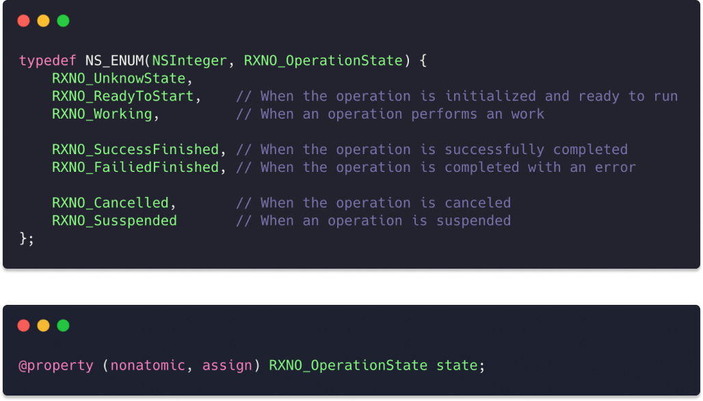

К примеру если операция была отменена, то ее статус будет равняться `RXNO_FailedFinished`.<br>А если была выполнена успешно, то `RXNO_SuccessFinished`.

<br>

## Примеры использования <a name="paragraph6"></a>

### Демонстрация работы класса DTO  <a name="paragraph7"></a>

#### Загрузка json  <a name="paragraph8"></a>

<br>
[Copy code](Documenation/CodeSnippets/snippet1.txt)

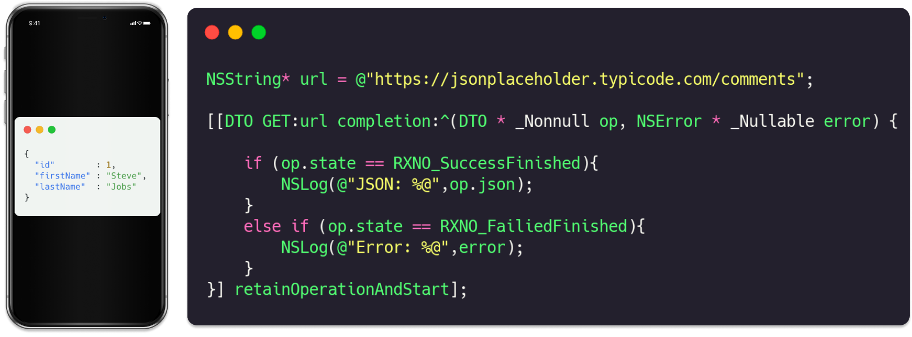

<br>

#### Загрузка изображения  <a name="paragraph9"></a>

<br> 
[Copy code](Documenation/CodeSnippets/snippet2.txt)

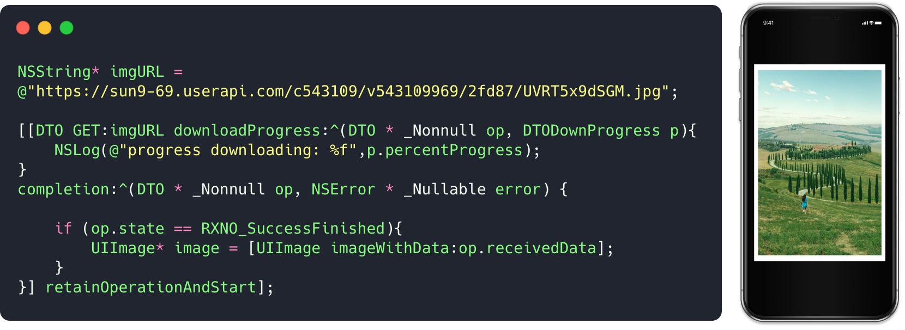

<br><br>

### Демонстрация работы класса UO  <a name="paragraph10"></a>

#### Конвертирование изображения в бинарный код и выгрузка на сервер как NSDictionary  <a name="paragraph11"></a>

<br>
[Copy code](Documenation/CodeSnippets/snippet3.txt)

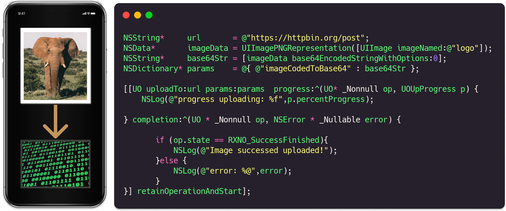

<br>

#### Конвертирование объекта в бинарный код и выгрузка данных на сервер в формате NSData  <a name="paragraph12"></a>

<br>

[Copy code](Documenation/CodeSnippets/snippet4.txt)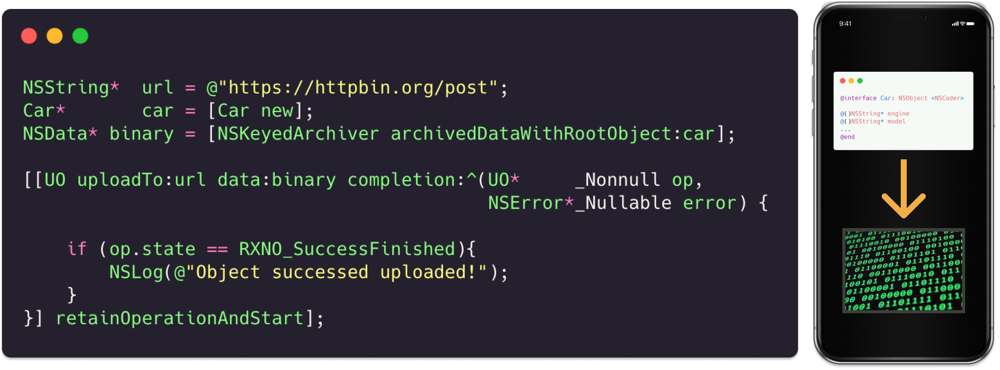

<br>

#### Выгрузка файла с локального NSURL, без предварительной конвертации в бинарный код  <a name="paragraph13"></a>

[Copy code](Documenation/CodeSnippets/snippet5.txt)

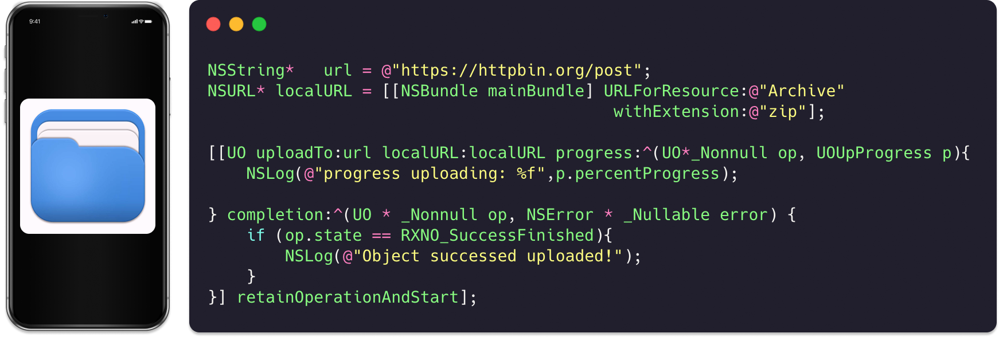

<br><br>

### Демонстрация работы класса DO  <a name="paragraph14"></a>

#### Загрузка файла и запись на диск <a name="paragraph15"></a>

<br>

[Copy code](Documenation/CodeSnippets/snippet6.txt)

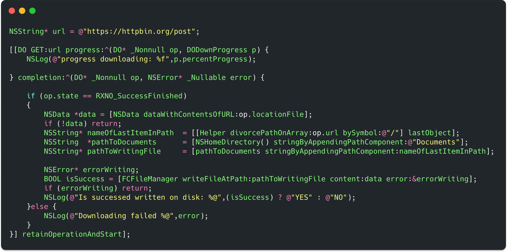

<br>

#### Загрузка файла на приватной сессии с возможностью продолжения работы на заблокированном устройстве  <a name="paragraph16"></a>

Для поддержки загрузки в фоновом режиме необходимо создать собственную сессию с конфигурацией `backgroundSession`, а затем созданную сессию установить в проперти `privateSession`.<br>

[Copy code](Documenation/CodeSnippets/snippet7.txt)

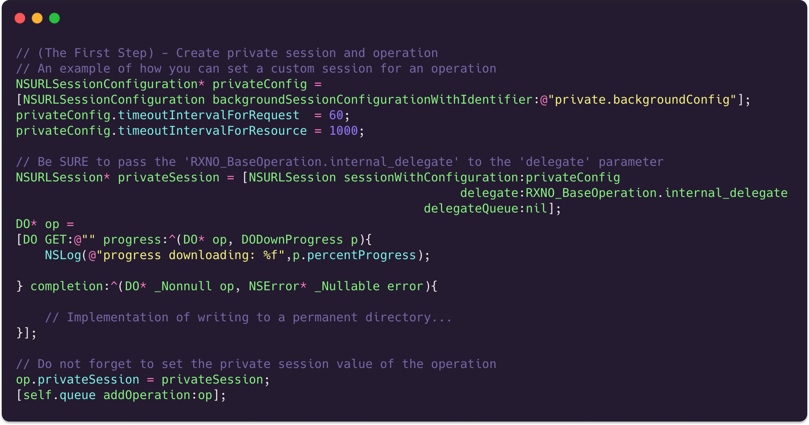

<br>Если вы хотите, чтобы ваша операция (с приватным сеансом) поддерживала загрузку в фоновом режиме, то вы должны добавить блок из этого метода в словарь `RXNO_BaseOperation.backgroundCompletions`.
<br>

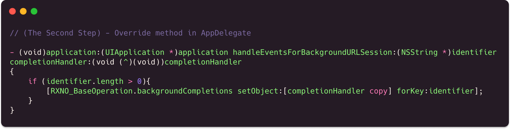

<br>

<br>

## DefaultSession / PrivateSession  <a name="paragraph17"></a>

По умолчанию все операции выполняются на сессии, которая является проперти класса `RXNO_BaseOperation`. <br>Но разрабатывая данный класс был предусмотрен вариант, когда пользователю может потребоваться возможность инициализировать собственную сессию с кастомными параметрами.<br><br>Как например это показано выше, когда для возможности скачивания данных в фоновом режиме (это когда iphone заблокирован), вам потребуется сессия со специальной конфигурацией.<br>

<br>Специально для того случая было создано проперти `privateSession`, если вы инициализируете которое, тогда проперти`task` той операции будет создано с помощью именно `privateSession`, а не `defaultSession`.

```objectivec
@interface RXNO_BaseOperation : NSOperation 
...
@property (nonatomic, strong, nullable) NSURLSession* privateSession;
@property (nonatomic, strong, class)    NSURLSession* defaultSession;

@property (nonatomic, strong, readonly) NSURLSessionTask*  task;
...
@end
```

**⚠️ Обратите внимание на важный момент использования !**

Когда вы создаете приватную сессию, в качестве делегата вы **ОБЯЗАТЕЛЬНО** должны указать объект 
`RXNO_BaseOperation.internal_delegate`.<br>Это нужно для корректного функционирования вашей операции.
Иначе ни один метод делегата и ни один блок вызван не будет.

```objectivec
NSURLSession* privateSession =
[NSURLSession sessionWithConfiguration:privateConfig
                              delegate:RXNO_BaseOperation.internal_delegate
                         delegateQueue:nil];
```

<br><br>

## Синхронное выполнение  <a name="paragraph18"></a>

Одним из главных конкурентных преимуществ **RXNO** над конкурентами технологиями, это возможность синхронно выполнять `http-запрос`, что в свою очередь полностью избавляет пользователя от `callback-hell`.<br>Чтобы синхронно выполнить операцию, вам всего лишь потребуется вызвать метод `syncStart`.<br><br>**⚠️  Для избегания блокирования главного потока, рекомендуется синхронно выполнять операции на фоновых очередях.**

```objectivec
 dispatch_async(dispatch_get_global_queue(DISPATCH_QUEUE_PRIORITY_DEFAULT, 0), ^{
      DTO* getImageOp = [[DTO GET:url] syncStart];
      UIImage* image = [UIImage imageWithData:getImageOp.receivedData]
 });
```

<br><br>

## Ограничения по времени <a name="paragraph19"></a>

Во время работы с табличными представлениями когда пользователь интенсивно загружает контент, часто может возникнуть ситуация, когда вам потребуется ограничить частоту выполнения сетевых запросов.<br>Для решения данного вопроса было внедрено проперти `timeLimitBetweenRunsOperations`, значение которого по умолчанию является `0`.<br><br>Механизм ограничения функционирует по следующему принципу:<br>Во время вызова метода `start` если проперти `timeLimitBetweenRunsOperations` содержит значение больше нуля, инициализируется проперти `NSDate* dateDelayAfterExecution`, которое по умолчанию всегда будет содержать дату **24** часа от момента начала выполнения операции.<br><br>

Как только операция будет выполнена, то проперти `dateDelayAfterExecution` будет проинициализировано (конечно же если `timeLimitBetweenRunsOperations` больше нуля) на дату `текущий момент` + интервал из `timeLimitBetweenRunsOperations`.<br>
Что позволит вам  в дальнейшем проверять истекла ли эта дата, перед запуском очередной операции.<br>

Подобная практика может быть полезной не только для табличных представлений, а также и для обычных кнопок, после нажатия которых оправляется некий запрос на сервер.<br><br>Подобный механизм ограждает пользователя от случайной отправки запроса несколько раз подряд, а также снижает нагрузку на сервер, если приложением пользуется большое количество пользователей.<br><br>
[Copy code](Documenation/CodeSnippets/snippet8.txt)

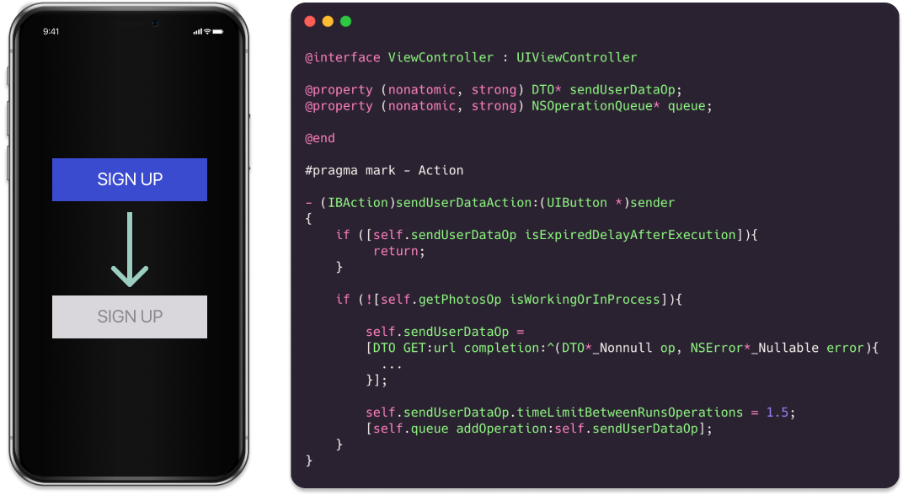 

<br><br>

## Методы описывающие состояния операции <a name="paragraph20"></a>

Также из листинга находящегося выше можно заметить методы по типу `isWorkingOrInProcess` и `isFinishedOrCancelled`.<br>Данные методы возвращают `BOOL` переменные, если `state` операции имеет определенные значения.

| Метод                              | Возвращает YES, если:                                                     |
| ---------------------------------- | ------------------------------------------------------------------------- |
| - (BOOL) **isWorkingOrInProcess**  | `state` == `RXNO_Working`/`RXNO_ReadyToStart`/`RXNO_Susspended`           |
| - (BOOL) **isFinishedOrCancelled** | `state` == `RXNO_SuccessFinished`/`RXNO_FailiedFinished`/`RXNO_Cancelled` |

Если после окончания операции вы хотите распечатать ее `state`, то для вашего удобство была создана функция `stateDescription`.

```objectivec
[[DTO GET:url completion:^(DTO * _Nonnull op, NSError * _Nullable error) {
        NSLog(@"%@",[op stateDescription]);
}] retainOperationAndStart];
```

<br>

<br>

## Приостановка и возобновление операций <a name="paragraph21"></a>

Операции фраемворка **RXNO** поддерживают полный цикл изменений состояний своего выполнения, по принципу единственной кнопки `play/stop`. 
То есть если вы вызываете метод `startSuspendResume`, то он переводит операцию в следующие логическое состояние, например `(ReadyToStart)->(Working)->(Suspended)-(Resume)->...  `

Также в отличие от использования на прямую технологий apple или сторонних библиотек, вы без всякой дополнительной логики можете приостановить выполнение, а затем также в одну строчку возобновить.<br>То есть лично вам не придется что-то пере инициализировать.

Но есть один важный момент, ⚠️  если вы отменили операцию (вызвали метод `cancel`), то возобновить ее уже нельзя.<br>Операция может быть возобновлена, только если вы перед этим вызвали метод `suspendTask`.

```objectivec
 - (IBAction) startSuspendResumeOperation
 {
   [self.downoadMediaOperation startSuspendResume];
 }

 - (IBAction) cancelDownloadingMediaContent
 {
    [self.downloadMediaOperation cancel];
 }
```

<br>

<br>

## Отмена запланированных операций <a name="paragraph22"></a>

Если вы для запуска операций используете `NSOperationQueue`, которая имеет ограничение по одновременному выполнению операций, у вас может возникнуть следующая ситуация.<br><br>Когда пользователь с помощью `UINavigationController`, переходит на следующий экран, с которого в очередь добавляется `N` операций. И они не успевают выполняются все одновременно (по причине ограничения о котором написано выше), а затем пользователь покидает данный контроллер, то возникает следующие обстоятельство.<br><br>Де-факто с того контроллера вы уже ушли, а операции в очереди имеются, когда подойдет их черед, они будут выполнены, то есть они скачают или выгрузят некоторые данные.<br>Но это не будет иметь никакого смысла, потому на данный момент это уже не актуально.<br><br>Поэтому нужно использовать определенный механизм библиотеки `RXNO`, который позволяет своевременно отменять операции.<br><br>Соответственно перед нами встает задача, как проходя по массиву `operations` нашей очереди, мы можем определить, что данные операции были созданны на этом контроллере ? <br>Одним из возможных решений может быть практика "насечения пометок", что данная операция была созданна данным контроллером.<br><br>Для того, чтобы пользователь мог насечь пометку, каждая операция имеет проперти `owner`.<br>В него рекомендуется записывать именно адрес памяти родительского объекта (им может быть ваш контроллер или вьюмодель).<br>Для чего собственно также существует вспомогательный метод `+addressInMemory:` класса `RXNO_BaseOperation`.<br><br>
Далее в методе деструкторе `dealloc` вашего родительского объекта, вам на выбор предлагается два способа отмены операций.

1) **cancelAllNetworkOperationsByEqual** - Проходит в цикле по `queue.operations`  и отменяет все операции, имеющие тот же объект в проперти `owner`, что и переданный объект из аргумента. 
   Проверка происходит с помощью вызова функции **isEqual**.

2) **cancelAllNetworkOperationsByEqualToString** - Проходит в цикле по `queue.operations` и отменяет все операции, имеющие такой же набор символов в `owner`, что и переданный объект из аргумента. 
   Проверка происходит с помощью вызова функции **isEqualToString**.

⚠️  Важно понимать, что если вы используете первый метод (который проверяет с помощью `isEqual`), то две строки, которые содержат один и тот же набор символов, будут признаны разным объектами, поскольку базируются в разных ячейках памяти.<br><br>Поэтому крайне рекомендуется использовать второй метод, который проверяет по идентичности набора символов.<br><br>
**Пример:**<br>

[Copy code](Documenation/CodeSnippets/snippet9.txt)
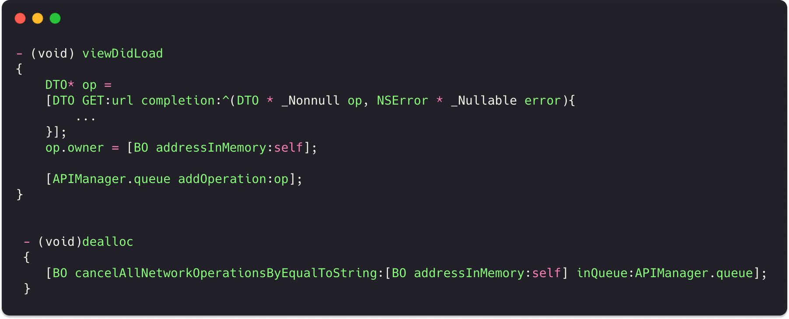

<br><br>

## Отложенные операции <a name="paragraph23"></a>

Поскольку каждый сервис где пользователю предоставляется возможность завести личный аккаунт, так или иначе реализует механизм выдачи токенов после успешной аутентификации, то перед абсолютным большинством разработчиков встают следующие вопросы: <br><br>

1. "**Что делать когда выполненный http-запрос завершается ошибкой 401?**"

2. "**Каким образом получить свежий токен ?**"

И самый главный вопрос:

3. "**Как повторно выполнить сетевую операцию которая завершилась неудачей ?**"<br>

Первые два вопроса можно отнести больше к зоне ответственности некого `APIManager`.<br>А последний, вполне лежит на стороне ответственности фреймворка.<br>

<br>

Специально для таких случаев класс `RXNO_BaseOperation` имеет массив так называемых **"отложенных операций"** (`postponedOperations`).<br>По сути название говорит само за себя, если операция заканчивается ошибкой, то ее "откладывают", получают свежий токен, а затем выполняют повторно.<br>

Первый этап обработки данной ошибки можно увидеть на схеме ниже:<br>


<br>

Правилом хорошего тона будет то, если непосредственную логику обработки `401`-ой ошибки, мы вынесем в другой метод, чтобы она не содержалась в `completion` блоке каждой сетевой операции.<br><br>Ниже будут приведены несколько достаточно сложных отрезков кода из реального приложения, чтобы показать как примерно реализуется подобный механизм.<br>(*примечание: пример являются сокращенным для лучшего понимания и концентрации на главных моментах.*)<br>

Итак, первым мы можем видеть метод API менеджера, который инициализирует сетевую операцию, а в ее `completion` блоке вызывается функция `checkOnServerAndOtherError`, которая непосредственно осуществляет проверку (в том числе и на ошибку `401`) и "откладывает" операцию если это нужно.<br>

[Copy code](Documenation/CodeSnippets/snippet10.txt)

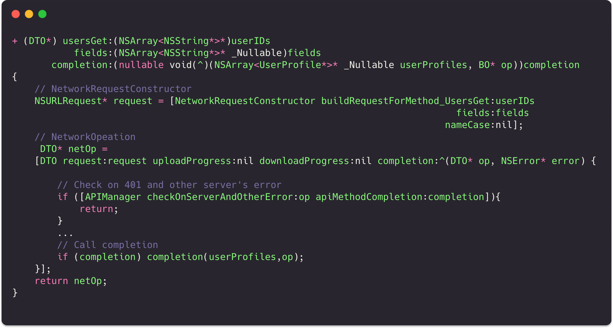

<br>

`checkOnServerAndOtherError` проверяет операцию на наличие ошибок.  
Если обнаружит `401`, то отложит операцию, вызвав метод `postponeOperation`.  
Также если операция выполнялась синхронно, то для нее у проперти `isMayUnlockSemaphore`будет установленно значение `NO`, для того, чтобы мы сначала получили новый токен, выполнили саму операцию и когда она будет успешно выполнена, то только тогда можно будет разблокировать поток.<br>

[Copy code](Documenation/CodeSnippets/snippet11.txt)

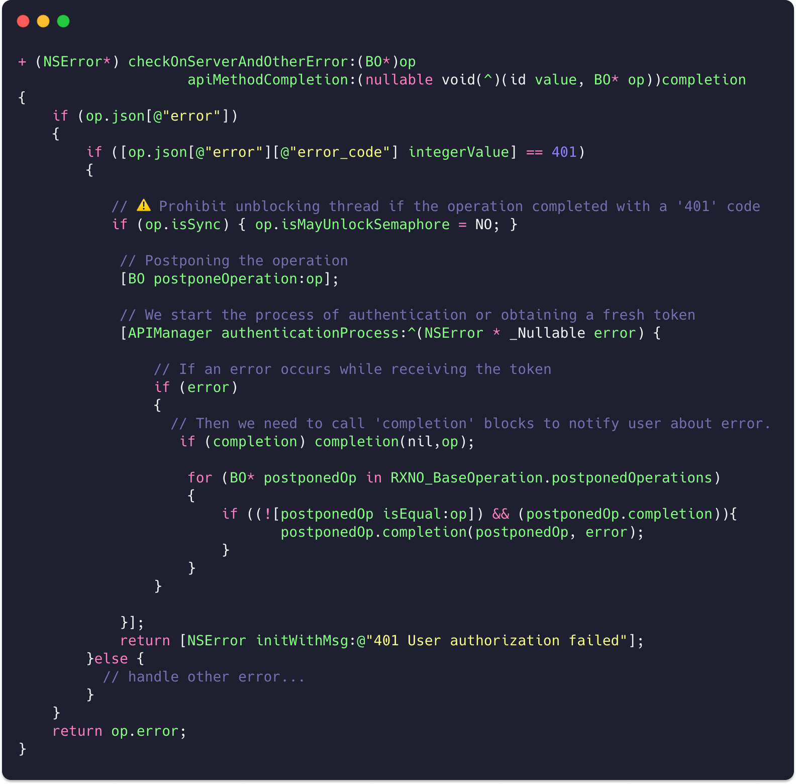

В метод `receiveTokenFromWebViewAuth` приходит свежий токен, или ошибка если он не был получен.<br>Если произошла ошибка в получении токена, то мы должны разблокировать ранее замороженные потоки, затем удалить все отложенные операции из массива.<br><br>
Если токен был успешно получен, то сохраняем его и вызываем метод `performPostponedOperationsOnQueue`.<br>В блоке `updateOperationBlock` мы должны вставить новый токен в каждую операцию, а затем вернуть этот массив обратно блоку.<br>(примечание: *для некоторых сервисов токен может передавать в параметрах, а для некоторых исключительно в хедерах*).<br>Далее метод получая операции с вставленным свежим токеном, проводит некоторые внутренние трюки и вставляет операции в очередь на выполнение.

[Copy code](Documenation/CodeSnippets/snippet12.txt)

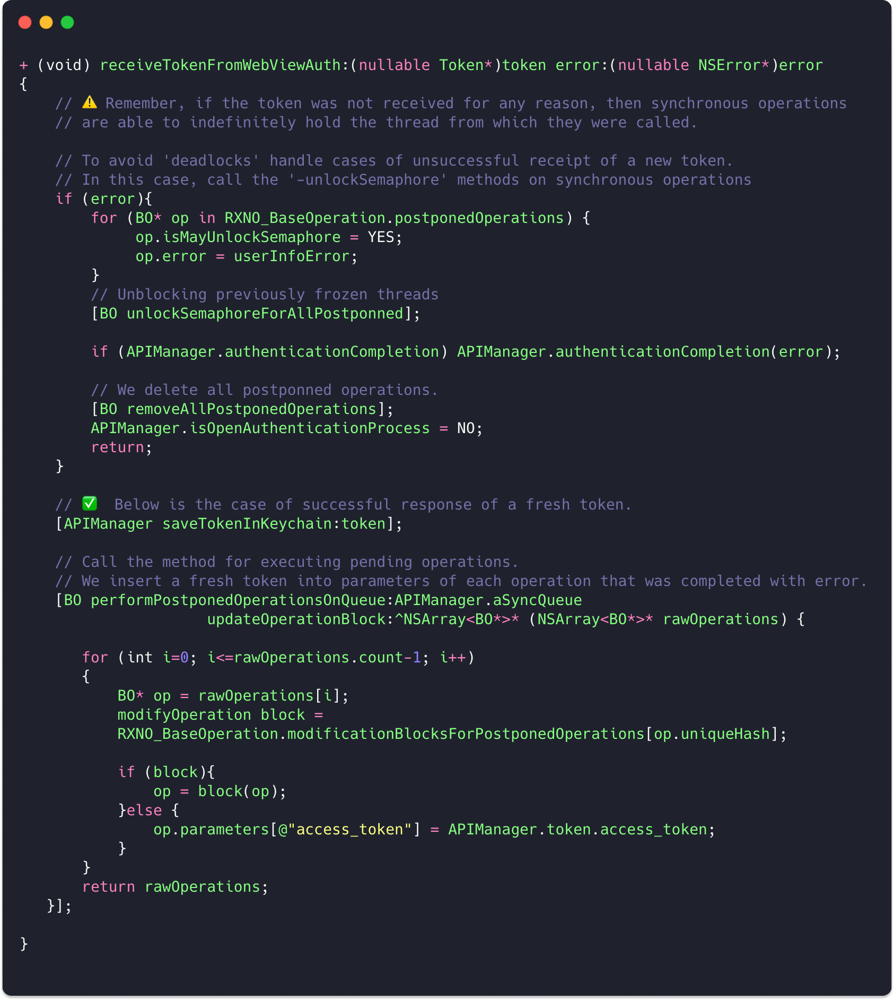

<br>Главным из всего примера является последовательность вызываемых методов.

1. Сначала откладываем операцию с помощью `postponeOperation`.

2. А после получения токена вызываем `performPostponedOperationsOnQueue`, чтобы вставить новый токен в каждую отложенную операцию и передать их на выполнение.

<br><br>

## Групповые операции <a name="paragraph24"></a>

Когда для выполнения некой функциональной обязанности вам требуется выполнить несколько `http-запросов` подряд, когда данные для каждого следующего запроса формируются от полученного ответа на предыдущий запрос, вы неизбежно сталкиваетесь с таким явлением как `callback-hell`.<br><br>

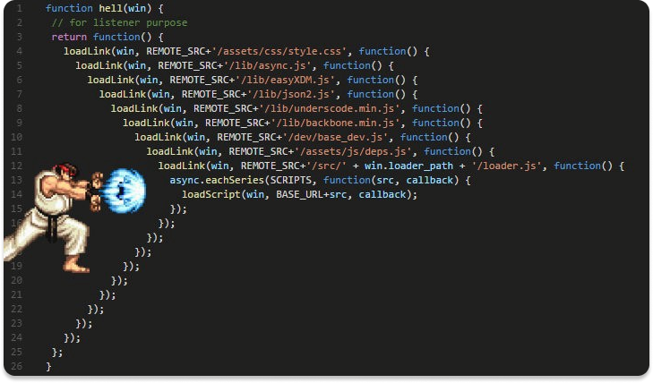

<br>

Для избежания подобного явления, были разработаны так называемые **"групповые операции"**.


`RXNO_GroupOperation` имеет некую схожесть с `NSBlockOperation`, и предназначен для того, чтобы в теле его `mainBlock` вы синхронно запускали выполнение обычных сетевых операций, для избежания возникновения `callback-hell`.<br><br>

В примере ниже мы инициализируем групповую операцию, затем инициализируем две сетевые операции и синхронно их выполняем.<br>

[Copy code](Documenation/CodeSnippets/snippet13.txt)

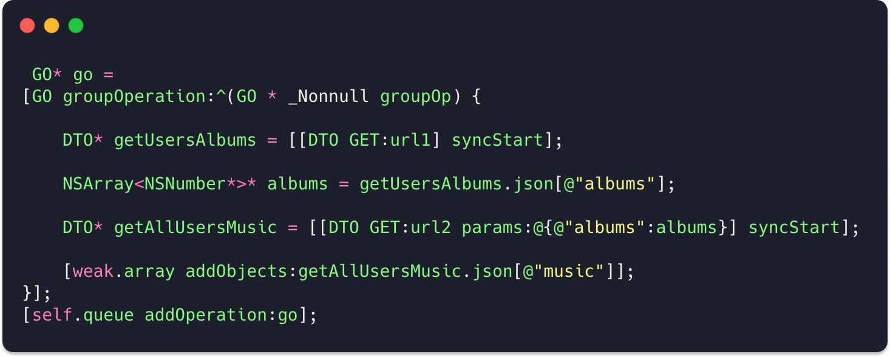

<br>Таким образом при использовании групповых операций мы полностью избавляемся от такого явления как **callback-hell**, что существенно экономит время разработки.<br><br>Также групповые операции поддерживают неограниченную вложенность, что означает, что одну групповую операцию можно вставлять в тело другой, что в конечном итоге позволяет пользователю получить данные вызвав все лишь один метод.<br><br>

---

Самым главным вопросом при работе с групповыми операциями является следующий:
"**Как отменять работу групповой операции ?**".<br>

Саму групповую операцию можно отменить просто вызывав метод `cancel`, а вот, для того чтобы отменить операции которые в ней выполняются, нужно прописывать условия в их `progress` блоки.<br><br>Обратите внимание на проперти result и resultClass, в них мы записываем результат работы групповой операции.<br>Это делается для общего удобства, потому что групповую операцию можно хранить как проперти, а переменная `result` всегда будет позволять быстро обращаться к результатам ее деятельности.<br><br>Например, когда это может пригодиться: <br>представим, что нам нужно получить массив оценок с каждого предмета, а потом основываясь на всех них - вычислить средний балл. 
Удобнее всего будет не создавать отдельное проперти в контроллере или вьюМодели, а просто записать ее в переменную `result`.

[Copy code](Documenation/CodeSnippets/snippet14.txt)

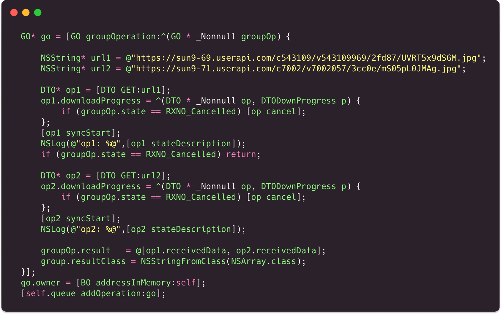

<br>

---

И наконец самый момент в использовании групповых операций это вопрос:<br> "**Как отменять групповые операции которые содержат другие групповые операции ?**"<br><br>
Подобный кейс удобнее  всего разобрать на следующем примере:<br>

> Наша задача получить информацию о всем медиа контенте пользователя.
> То есть, получить все его аудио и получить все его видео.
> Представим, что это крайне трудоемкий процесс. 
> Потому что, чтобы получить все песни, мы сначала должны получить номера всех альбомов, потом скачать песни из каждого альбома и только потом соединить их в один общий массив.

<br>

[Copy code](Documenation/CodeSnippets/snippet15.txt)

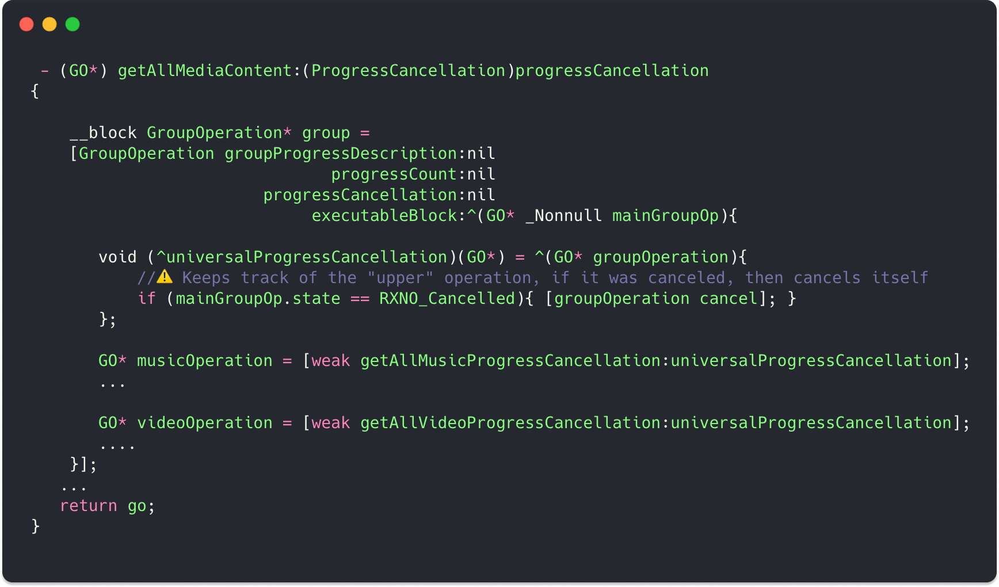

Для того чтобы реализовать поддержку отмены вложенных групповых операций, мы должны в методах их создания иметь такой параметр как `progressCancellation`.<br>

Его должны вызывать в прогресс блоках обычных сетевых операций.<br>Тогда если главная операция будет отменена, то реализуя `progressCancellation` (который вызывается из обычных прогресс блоков скачивания), будут отменны и вложенные групповые операции, а затем и их вложенные обычные сетевые операции. <br><br>

[Copy code](Documenation/CodeSnippets/snippet16.txt)

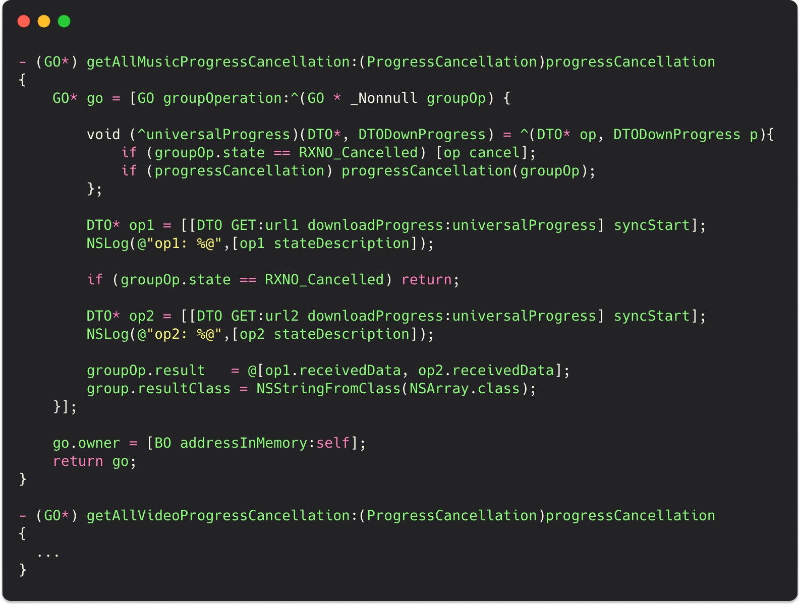

<br><br>

## Result и resultClass <a name="paragraph25"></a>

Проперти `result` и `resultClass` были созданы, для того чтобы, сетевые операции могли хранить в них результаты своих вычислений, чаще всего такая потребность есть когда они выполняются в групповых операциях.<br>

[Copy code](Documenation/CodeSnippets/snippet17.txt)

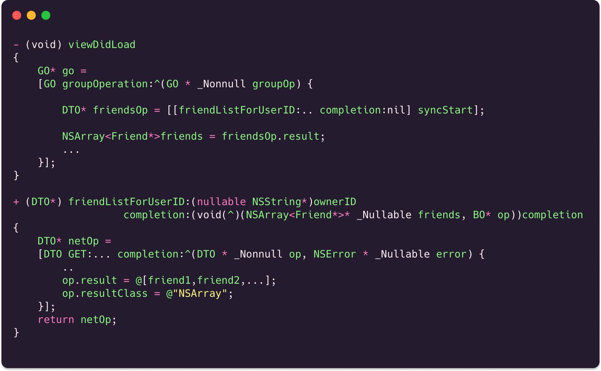

<br><br>

## Плюсы <a name="paragraph26"></a>

- Главным плюсом является тот факт, что сетевыми операциями может успешно пользоваться менее опытный разработчик. В результате чего цена разработки снижается.

- Вторым по значимости преимуществом является крайняя лаконичность в сравнении с другими продуктами доступными на рынке.
  Как правило, вам потребуется написать в среднем от **3** до **33** раз меньше кода.

- Третьим плюсом является то, что библиотека предоставляет новаторские механизмы, которые просто отсутствуют в других фреймворках, что позволяет управлять вашим сетевым стеком не создавая сложной архитектуры.

<br>

## Features <a name="paragraph27"></a>


<br>

## Рекомендации <a name="paragraph28"></a>

Для записи файлов из временных каталогов в постоянные рекомендуется использовать библиотеку [FCFileManager](https://github.com/fabiocaccamo/FCFileManager).<br>

## Дополнительно <a name="paragraph29"></a>

[🇬🇧 English Readme](README.md) <br>

## Автор <a name="paragraph30"></a>

👨🏼‍💻 [@m1a7](https://github.com/m1a7/RXNetworkOperation/blob/master/github.com/m1a7)  
👌🏻 [thisismymail03@gmail.com](mailto:thisismymail03@gmail.com)
