# Table of Contents

- [💎 Definition](#definition)

- [⁉️ The reason for the creation of RXNetworkOperation](#the-reason-for-the-creation-of-RXNetworkOperation)

- [👓 Description of Operations](#description-of-operations)

- [💡 Concept](#concept)

- [🍑 Benefits from NSOperation](#benefits-from-nsoperation)

- [🏗 Methods of management of the operation](#methods-of-management-of-operations)

- [🤖 Feedback from the user object](#feedback-from-the-user-object)

- [🚧 Important detail](#important-detail)

- [🍭 LifeHacks](#lifehacks)

- [📖 Deep study](#deep-study)

- [💼 Сode snippets](#code-snippets)

  - [RXNO_DataTaskOperation]()   

    - [Getting JSON](#getting-json)
    - [Getting Image](#getting-image)
    - [Posting JSON](#posting-json)

  - [RXNO_UploadOperation]()

    - [Upload By Params (NSDictionary)](#upload-by-params-(nsdictionary))
      
      

    - [Upload By Data (NSData)](#upload-by-data-(nsdata))

    - [Upload By Local URL (NSURL)](#upload-by-local-url-(nsurl))

  - [RXNO_DownloadOperation]()

    - [Downloading Image and writting on disk](#downloading-image-and-writting-on-disk)
    - [Downloading in background on privateSession](#downloading-in-background-on-privateSession)
    - [Downloading with help delegate-way](#downloading-with-help-delegate-way)

- [🗺 Recommendations](#recommendations)

<br><br>

## Definition:

`RXNetworkOperation` is an amazing tool that provides several subclasses of `NSOperation` to perform http requests.
With `RXNetworkOperation`, you do not need to have your own NetworkLayer to receive data from the network.

[Copy code](Documentation/TextSnippet/dto-get-json1.txt)

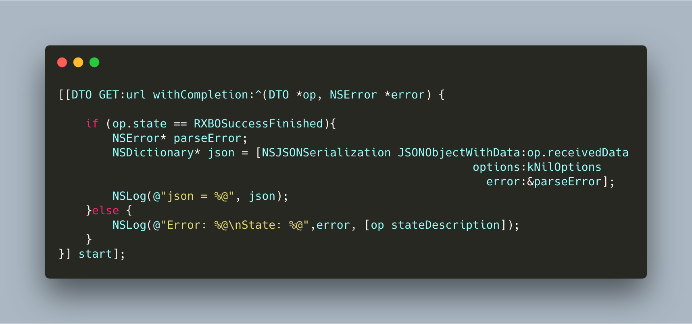

---

## The reason for the creation of RXNetworkOperation:

`RXNetworkOperation` was created in order to be able to make requests to the Internet and not have at the same time a large number of dependencies.

You will no longer need different `AFNetworking` /`Alamofire`, you will no longer need to become a delegate of `NSURLSession` and implement the same methods in each controller.

Just import ```#import <RXNetworkOperation/RXNetworkOperation.h>``` and make requests to the Internet - instantly.
And also You will feel the full power over network operations. You can stop and start again.

<br>

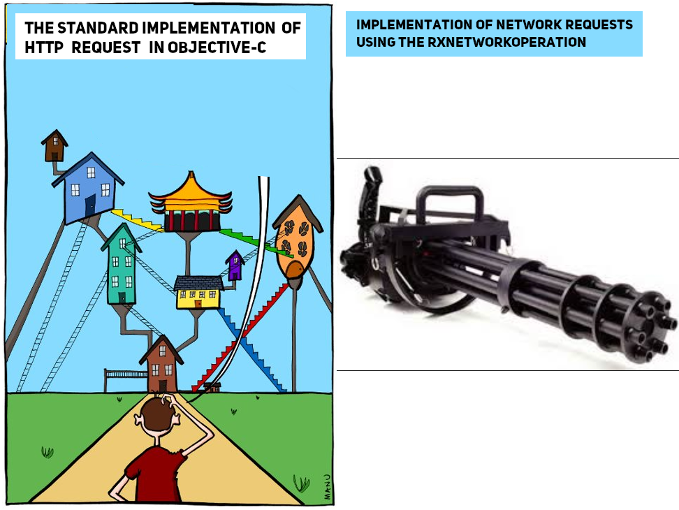

## Description of operations:

You are provided with a set of three classes **RXNO_DownloadOperation**, **RXNO_UploadOperation** and **RXNO_DataTaskOperation**.

1. `DO (RXNO_DownloadOperation)` - downloads data from the server and writes it to the device’s memory.
2. `UO (RXNO_UploadOperation) `- uploads the data you provide to the server.
3. `DTO (RXNO_DataTaskOperation)` - performs any HTTP requests (GET/POST/...) often used for routine operations (get json).

---

## Concept:

.png)
---

<br>

## Benefits from NSOperation:

Since all of our `DO`/`UO`/`DTO` classes are modified inheritors of `NSOperation` in the class interface, you have the option to `suspend`/`resume`/`cancel` operations.

---

## Methods of management of operations:

1) ```-(void)start ```     -  launch the task for the first time. (The next time (after suspending) we do not start the task, but resume it). <br>

2) ``` -(void) suspend ```  - pauses a previously running task. <br>

3) ``` -(void) resume ```   - resumes a previously suspended task. <br>

4) ```-(void) cancel```    - cancels the operation. (After calling this method, you cannot resume execution.) <br>

5) ` -(void) retainOperationAndStart` - Call this if you do not have a strong reference to the operation object.

                                                                         The operation will be added to the internal dictionary (in order to retain in 
                                                                         memory) and will start its execution.

6) `-(void) releaseRetainedOperation`- If you previously called the 'retainOperationAndStart' method and the 
                                                                            operation was added to the internal dictionary. 
                                                                            Be sure to call this method to remove the operation from memory.

All operations are created on the principle of  

> "one object(DO / UO / DTO) - one network task”

 as a result, you can easily control 
the process of performing a task. You can also create as many operations as you need and pass them on to the `NSOperationQueue` object.

---

## Feedback from the user object:

Each of the operation objects gives you the ability to interact with them through blocks or delegates.
Each case has its own constructors.

**Example**:

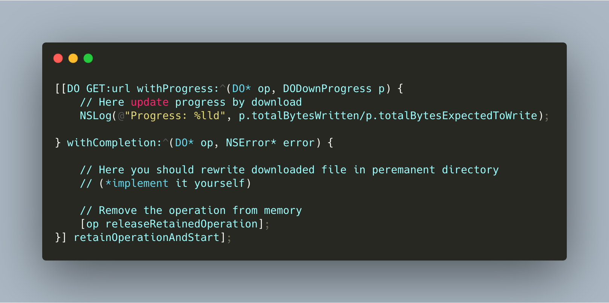 

## Important detail:

There are several important properties and methods in the `RXNO_BaseOperation.h` file.

1)```state ```- is an enum that displays the current state of the operation. 
   The operation can have the following States:

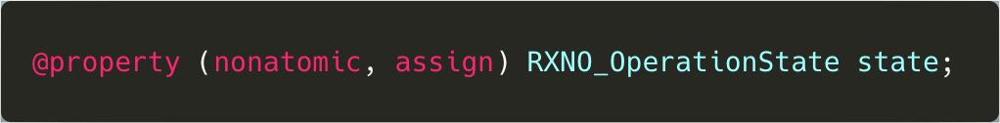
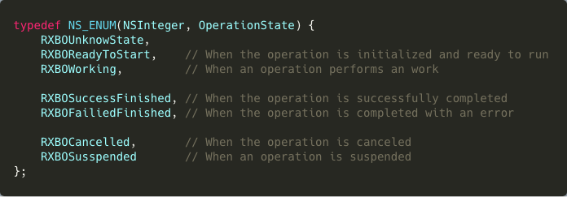

2) ```isPrintLogInConsole ``` - if `YES` then prints all method calls to the console. (Default is `NO`).

3) ```-(RXNO_OperationState)startSuspendResume``` -methods that works on the principle of the Play button in the player.
    That is, if the operation is not started - then run. if the work - suspend if you have suspended - resume.

4) ```-(NSString*)stateDescription```  - returns a string describing the status of the operation.

5) `defaultSession/PrivateSession`

    **RXNO_BaseOperation** has two references to instances of the session. 

| 1) NSURLSession* defaultSession     | This is the default session.<br/>                                   With its help, all requests are executed by default.<br/>                                   It is always initialized by an internal mechanism (because it is a class object).                                                                                                                                                                                                                                                                                                                                      |
| ----------------------------------- | -------------------------------------------------------------------------------------------------------------------------------------------------------------------------------------------------------------------------------------------------------------------------------------------------------------------------------------------------------------------------------------------------------------------------------------------------------------------------------------------------------------------------------------------------------------------------------------- |
| **2) NSURLSession* privateSession** | The default is nil. (this is an instance object).<br/>                                    This object is needed in case you want to perform a custom query with a certain specificity.<br/>                                    For example, you want to continue downloading in the background or increase the waiting time.<br/>                                    To understand whether you need to initialize a private session, [here](Documentation/TextSnippet/defaultSessionConfiguration.txt) you can familiarize yourself with the configuration that uses 'defaultSession'. |

(⚠️)  An important point, if you want your network operation to use 'privateSession' for your request, at the time of initializing the session to the 'delegate' parameter, **you SHOULD pass the object** `RXNO_BaseOperation.internal_delegate`.

`RXNO_BaseOperation.internal_delegate` is an internal class that handles message forwarding.

Examples of creating an operation with a private session can be found below.

---

## LifeHacks:

To make your syntax more concise, you can use abbreviations.

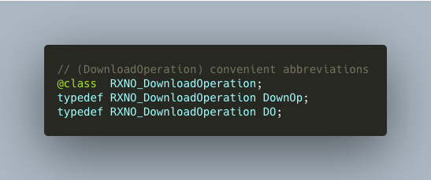

## Deep study:

If you want to explore the work of the framework in more detail, go to our Wiki. <br><br>
🚧 Attention! The wiki is only available in a private repository.

[🇺🇸 English Wiki](). <br>
[🇷🇺 Russian Wiki](). <br>

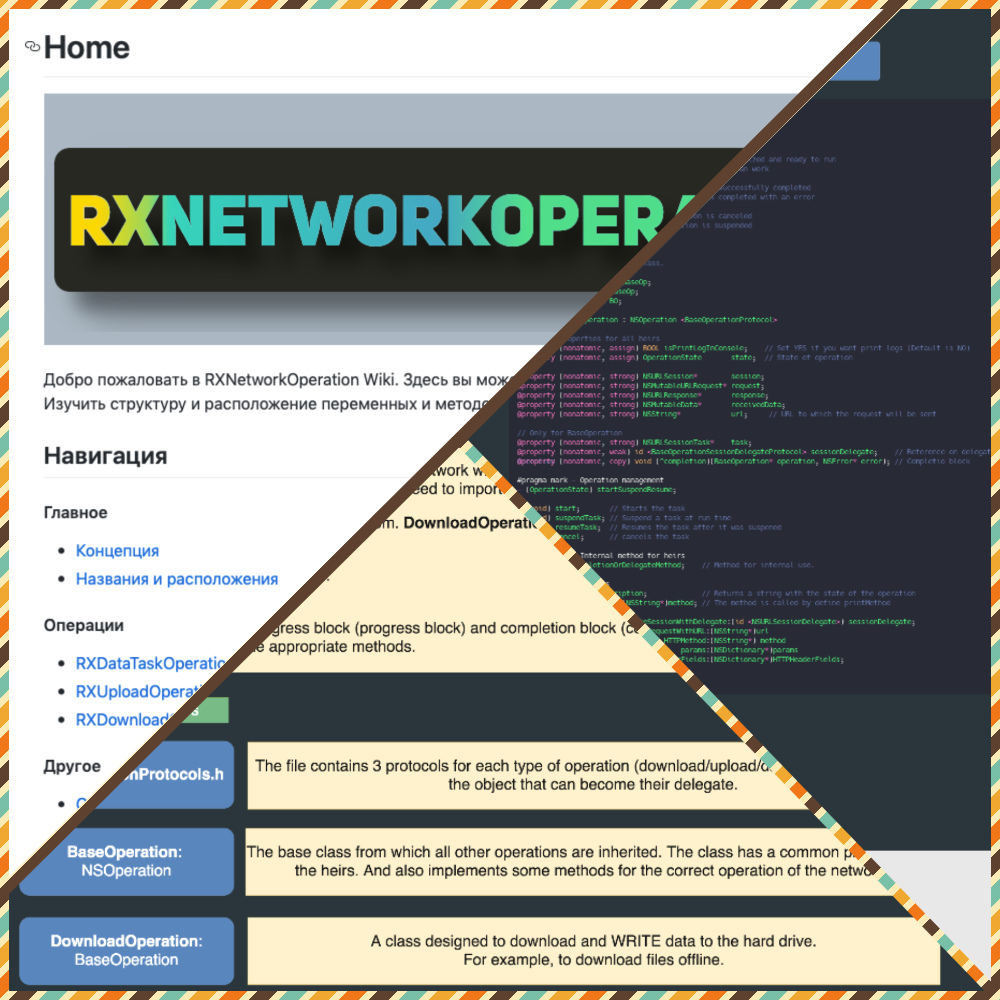

<br>

## Сode snippets:

## 1) The RXNO_DataTaskOperation class is used to perform everyday network requests.

### Getting JSON

 [Copy code](Documentation/TextSnippet/dto-get-json-withProgress.txt)
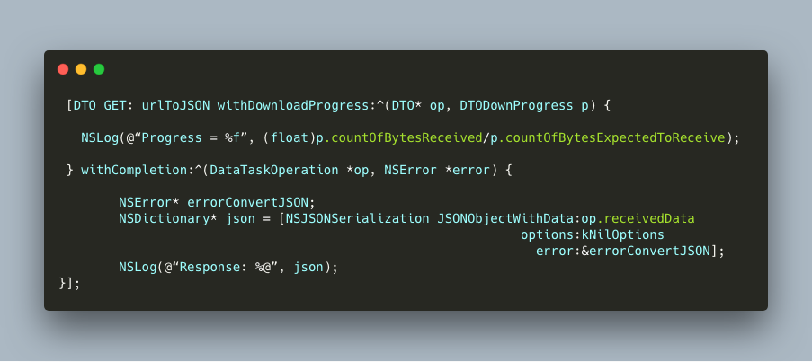

### Getting Image

 [Copy code](Documentation/TextSnippet/dto-get-image.txt)
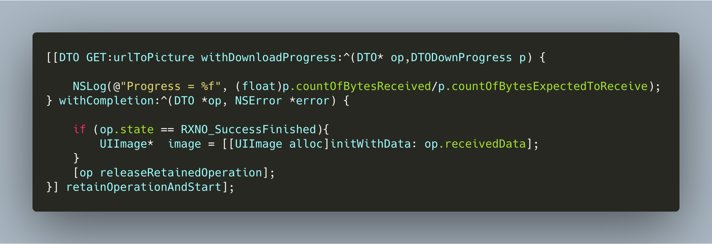

### Posting JSON

 [Copy code](Documentation/TextSnippet/dto-post-json.txt)
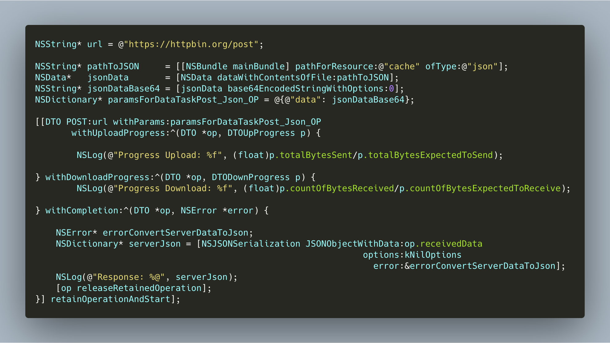

## 2) The RXNO_UploadOperation Class has three constructors for uploading data to the server

### Upload By Params (NSDictionary)

 [Copy code](Documentation/TextSnippet/upload-nsdictionary.txt)
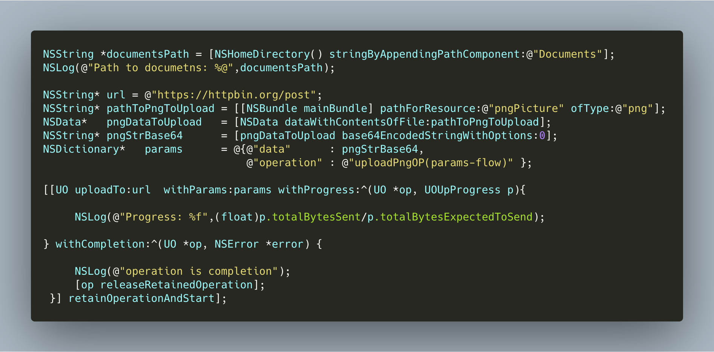

### Upload By Data (NSData)

 [Copy code](Documentation/TextSnippet/upload-nsdata.txt)
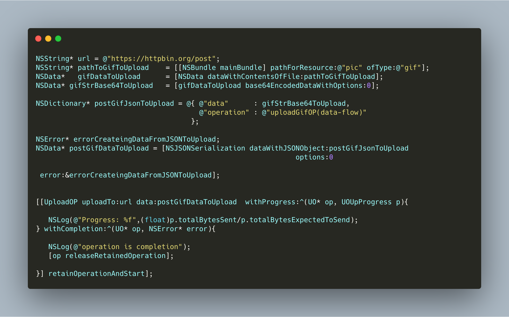

### Upload By Local URL (NSURL)

 [Copy code](Documentation/TextSnippet/upload-nsurl.txt)
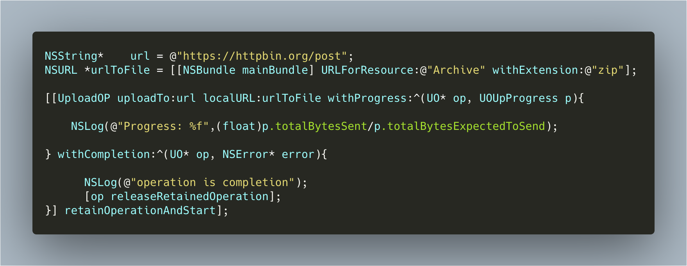

## 3) Example of using RXNO_DownloadOperation

### Downloading Image and writting on disk

 [Copy code](Documentation/TextSnippet/download-png.txt)
 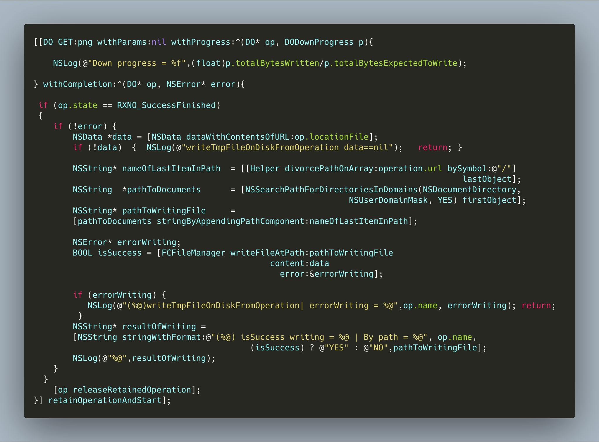

### Downloading in background on privateSession

[Copy code](Documentation/TextSnippet/download-inBackground.txt)

**(The First Step)** - Create private session and operation.

To support downloading in the background, you must set the value of the operation variable `privateSession`, and for this you must have a strong reference to the operation itself.

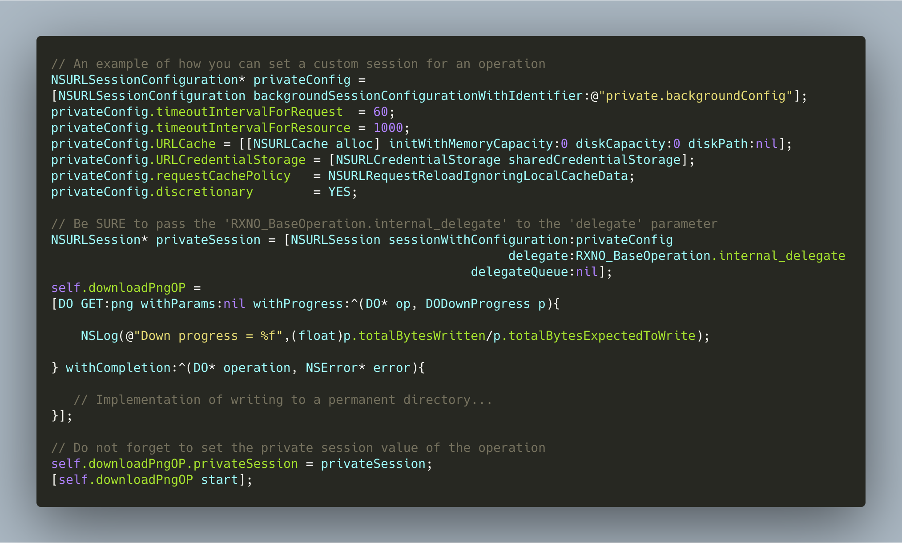

**(The Second Step)** - Override method in `AppDelegate`.

If you want your operation (with private session) to support downloading in background, then you must add the block from this method to the `RXNO_BaseOperation.backgroundCompletions` dictionary.


### Downloading with help delegate-way

You can also interact with operations through delegation.
To do this, depending on the type of operation (`DO`/`UO`/`DTO`), implement the required protocols in your delegates
(`NSURLSessionDelegate`/ 
`NSURLSessionDownloadDelegate`/
`NSURLSessionTaskDelegate`/
`NSURLSessionDataDelegate`).

In addition, `RXNetworkOperation` has a flexible mechanism, you can simultaneously initialize the operation with the interaction model `block-way`  and set the value in the property `external_delegate`, then the operation will call both handler blocks and delegate methods at the same time.

This can be useful if you need to log in to the server for further work.
To do this, the `-URLSession:didReceiveChallenge:completionHandler: `method will be called.

(⚠️) If you only have interaction through blocks, you will not be able to log in (without setting the value in `external_delegate`).

[Copy code](Documentation/TextSnippet/download-delegateWay.txt)
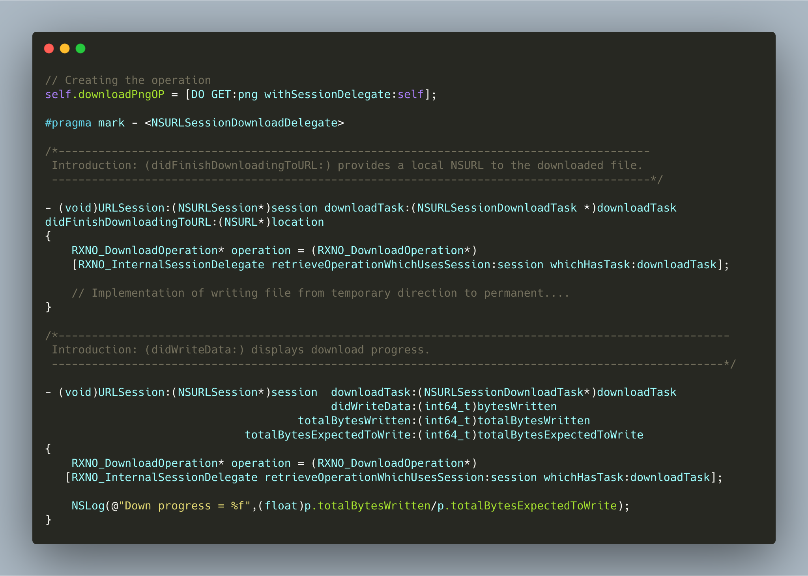

## Recommendations

To write files from temporary directories into permanent, we recommend using the [FCFileManager](https://github.com/fabiocaccamo/FCFileManager) library.

## Author

👨🏼‍💻 [@m1a7](github.com/m1a7) <br>
👌🏻 thisismymail03@gmail.com
