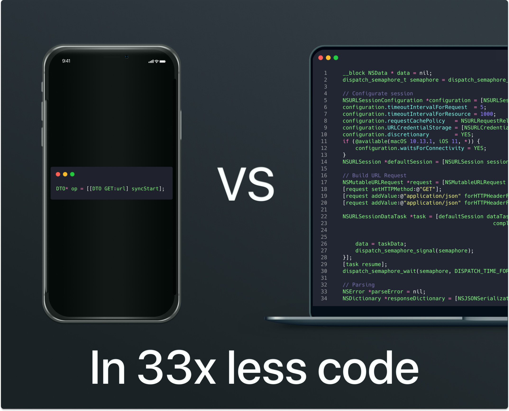
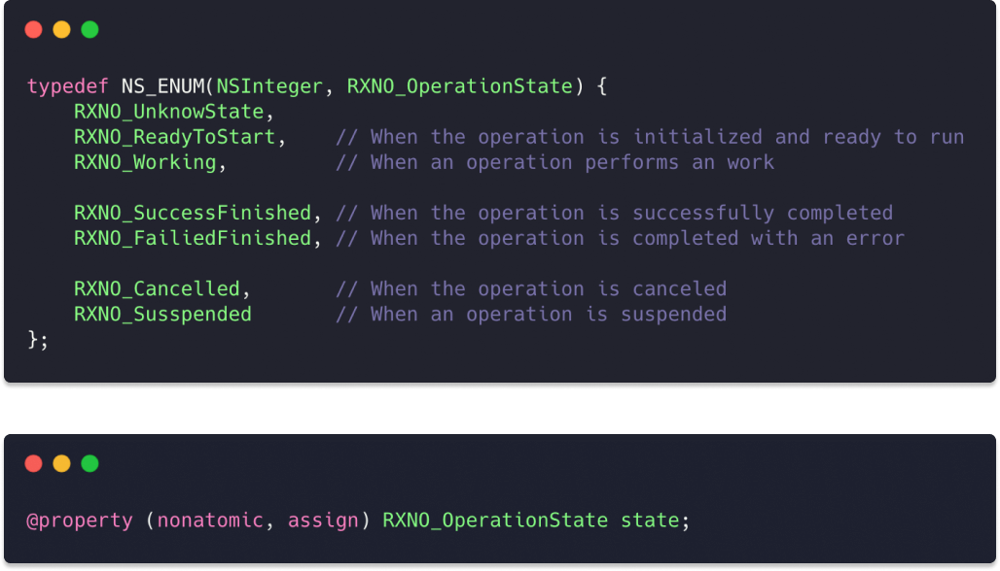
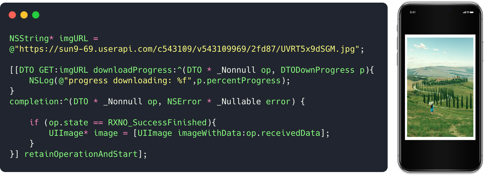
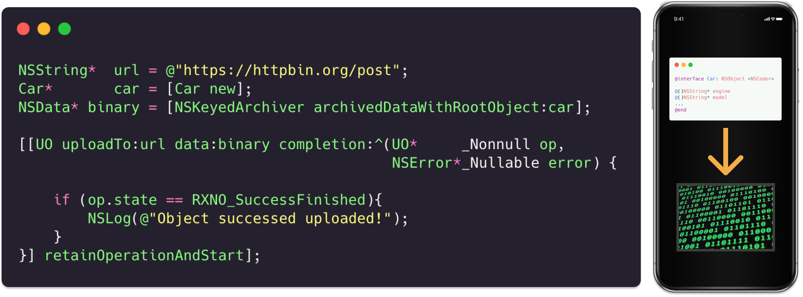
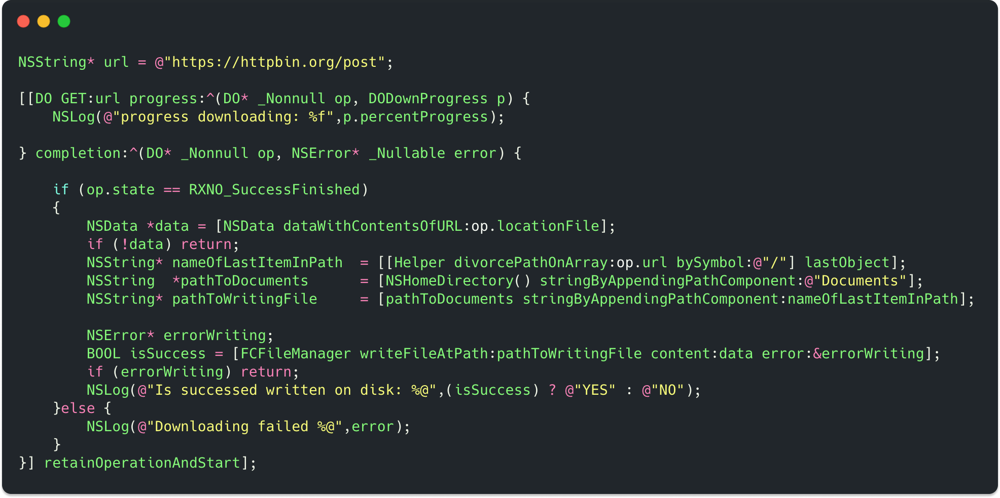
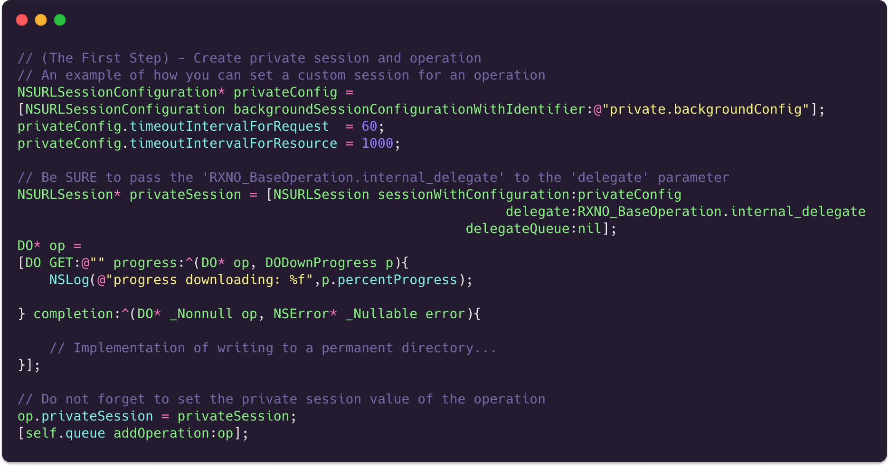
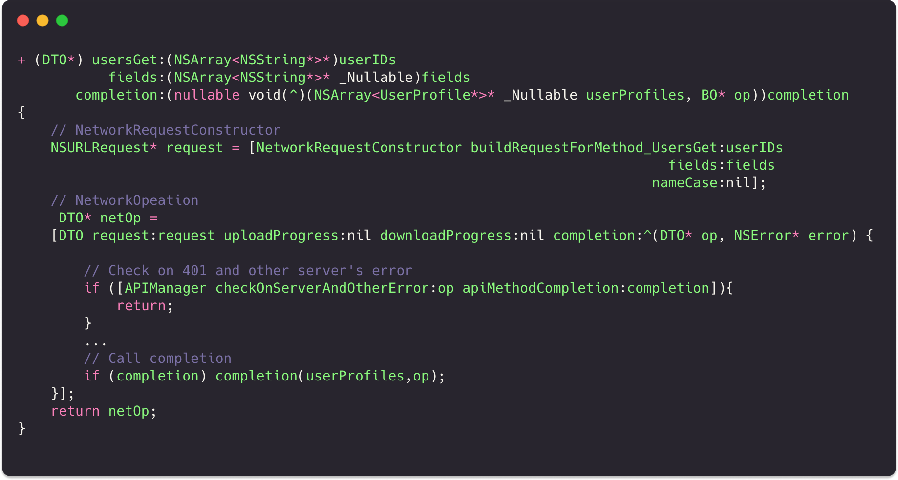
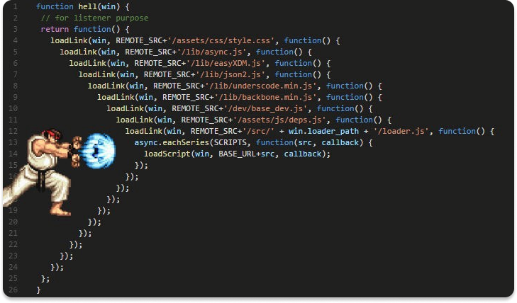
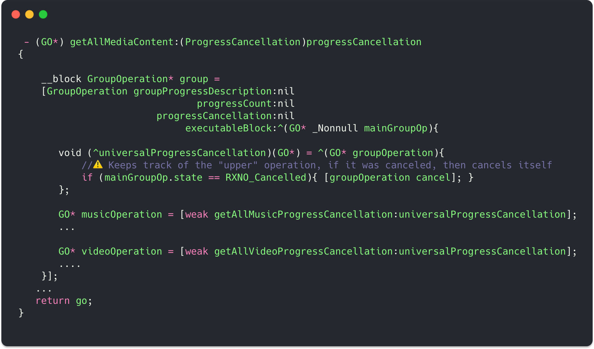

# Network operations

`RXNetworkOperation` is a powerful tool that performs `http` requests in a few lines of code. <br>

The library represents several subclasses of `NSOperation`, which contain a massive layer of logic for connecting to the Internet.<br> 
The main advantage of the technology, besides ease of use, is amazing conciseness. <br>

Comparing with the existing solutions on the market `iOS`/`OS X` development using `RXNO`, in some specific cases you will need to write **tens of times less code** than if you use traditional approaches.<br>



# Table of contents

- [Reason for creation RXNetworkOperation](#paragraph1)

- [Description of operations](#paragraph2)

- [Methods for managing operations](#paragraph3)

- [Ways to interact with operations](#paragraph4)

- [State of operations](#paragraph5)

- [Examples of usage](#paragraph6)
  
  - [Demonstration of DTO class work](#paragraph7)
    - [Download json](#paragraph8)
    - [Loading an image](#paragraph9)
  - [Demonstration of UO class work](#paragraph10)
    - [Uploading via NSDictionary](#paragraph11)
    - [Uploading via NSData](#paragraph12)
    - [Uploading via NSURL](#paragraph13)
  - [Demonstration of DO class work](#paragraph14)
    - [Downloading a file and writing to disk](#paragraph15)
    - [Downloading a file in a private session](#paragraph16)

- [DefaultSession / PrivateSession](#paragraph17)

- [Synchronous execution](#paragraph18)

- [Time limits](#paragraph19)

- [Methods describing the state of the operation](#paragraph20)

- [Suspending and resuming operations](#paragraph21)

- [Canceling scheduled operations](#paragraph22)

- [Postponed operations](#paragraph23)

- [Group operations](#paragraph24)

- [Result and resultClass](#paragraph25)

- [Advantages](#paragraph26)

- [Features](#paragraph27)

- [Recommendations](#paragraph28)

- [Additionally](#paragraph29)

- [Author](#paragraph30)

<br>

## Reason for creating RXNetworkOperation <a name="paragraph1"></a>

`RXNetworkOperation` was created to be able to make`http requests` without having a lot of imported dependencies.<br>

You no longer need different `AFNetworking`/`Alamofire`, you no longer need to become a delegate to `NSURLSession` and implement the same methods in every controller. <br>

Just import `#import <RXNetworkOperation/RXNetworkOperation.h>` and make requests instantly.<br> You will also feel complete power over network operations, which you can stop and resume at any time. <br>
<br>

## Description of operations <a name="paragraph2"></a>


The library provides you with several types of operations to choose from.<br>
You will need to choose one specifically for your situation.

| Class name               | Abbreviation | Functional responsibility                                                                                                                                                                                                                    |
| ------------------------ | ------------ | -------------------------------------------------------------------------------------------------------------------------------------------------------------------------------------------------------------------------------------------- |
| `RXNO_DataTaskOperation` | **DTO**      | Downloads data without writing to disk. <br/> Uploads data to the server. <br/> <br/> This is a universal and most commonly used class. <br/> Widely used for most day-to-day tasks, getting `json`, downloading images uploading data.<br/> |
| `RXNO_DownloadOperation` | **DO**       | Downloads data and writes it to disk as a separate file.                                                                                                                                                                                     |
| `RXNO_UploadOperation`   | **UO**       | It is intended for uploading data to the server, unlike `DTO` it has the distinctive ability to load data located on the device disk (without first converting it to `NSData`), for this it takes a local `NSURL` as parameters.             |

<br>

## Methods for managing operations <a name="paragraph3"></a>

Since all operations are direct inheritors of the NSOperation class, they, like their parent, have all the advantages of this technology. <br> Which are in the implementation of full control over the operation process. <br> All possible methods will be listed below manual control. <br>

| Name of method                                 | The result of executing                                                                                                                                               |
| ---------------------------------------------- | --------------------------------------------------------------------------------------------------------------------------------------------------------------------- |
| - (RXNO_OperationState) **startSuspendResume** | Changes the state of the operation every time the method is called.<br/>(ReadyToStart)->(Working)->(Suspended)-(Resume)->...                                          |
| - (void) **start**                             | Starts the operation for the first time. <br/> Later, if the operation is suspended, then it will be resumed this time (and not started again).                       |
| - (void) **suspendTask**                       | Suspends the execution of a running operation.                                                                                                                        |
| - (void) **resumeTask**                        | Resumes a previously suspended operation.                                                                                                                             |
| - (void) **cancel**                            | Cancels the operation. <br/> (You cannot resume execution after calling this method.)                                                                                 |
| - (BO*) **syncStart**                          | Starts the synchronous execution of the operation.                                                                                                                    |
| - (void) **retainOperationAndStart**           | Runs the operation asynchronously and holds the operation in memory by itself. <br/> This is required so that you do not have to create a property for the operation. |

If you want to manage operations in an automatic mode, you can simply insert them into the `NSOperationQueue`, which will automatically start executing them. <br>

<br>

## Ways to interact with operations <a name="paragraph4"></a>

The framework provides two ways to interact:

1) Working with blocks.

2) Working with delegates.

Unlike the disadvantages of `NSURLSessionTask`, any operation provides equal opportunities for each of the methods. <br> For example, if you want to display the loading process, then using blocks you can also get the necessary information. <br>

<br>

## State of operation <a name="paragraph5"></a>

By default, the `NSOperation` class uses several `BOOL` variables to determine the status of an operation, which is an extremely inconvenient engineering solution. <br>
In RXNO, this issue has been radically rethought, and now each operation has a property `state`, which stores its status. <br>



For example, if the operation was canceled, then its status will be equal to `RXNO_FailedFinished`. <br> And if it was successful, then `RXNO_SuccessFinished`.

<br>

## Examples of using <a name="paragraph6"></a>

### Demonstration of DTO class work  <a name="paragraph7"></a>

#### Downloading json  <a name="paragraph8"></a>


[Copy code](Documenation/CodeSnippets/snippet1.txt)


<br>

#### Downloading image  <a name="paragraph9"></a>


[Copy code](Documenation/CodeSnippets/snippet2.txt)



<br><br>

### Demonstration of UO class work  <a name="paragraph10"></a>

#### Converting an image to binary code and uploading it to the server as NSDictionary  <a name="paragraph11"></a>


[Copy code](Documenation/CodeSnippets/snippet3.txt)


<br>

#### Converting an object into a binary code and uploading data to a server in NSData format  <a name="paragraph12"></a>

[Copy code](Documenation/CodeSnippets/snippet4.txt)

<br>

#### Uploading a file from a local NSURL, without prior conversion to binary code  <a name="paragraph13"></a>

[Copy code](Documenation/CodeSnippets/snippet5.txt)


<br><br>

### Demonstration of DO class work  <a name="paragraph14"></a>

#### File download and write to disk <a name="paragraph15"></a>


[Copy code](Documenation/CodeSnippets/snippet6.txt)



<br>

#### Downloading a file in a private session with the ability to continue working on a locked device  <a name="paragraph16"></a>

To support downloading in the background, you need to create your own session with the `backgroundSession` configuration, and then set the created session in the `privateSession` property. <br>

[Copy code](Documenation/CodeSnippets/snippet7.txt)



<br>If you want your operation (with a private session) to support background loading, then you must add a block from this method to the `RXNO_BaseOperation.backgroundCompletions` dictionary.
<br>


<br>

<br>

## DefaultSession / PrivateSession  <a name="paragraph17"></a>

By default, all operations are performed in the session, which is property of the `RXNO_BaseOperation` class. <br> But while developing this class, an option was provided for when the user may need to be able to initialize his own session with custom parameters. <br> <br> As for example, it is shown above, when for the ability to download data in the background (this is when the iphone is locked), you need a session with a special configuration.<br>

<br> Especially for that case, a `privateSession` property was created, if you initialize which, then the `task` property of that operation will be created with the help of `privateSession`, not `defaultSession`.

```objectivec
@interface RXNO_BaseOperation : NSOperation 
...
@property (nonatomic, strong, nullable) NSURLSession* privateSession;
@property (nonatomic, strong, class)    NSURLSession* defaultSession;

@property (nonatomic, strong, readonly) NSURLSessionTask*  task;
...
@end
```

**⚠️  Pay attention to the important point of use!**

When you create a private session, you **MUST** specify an object as a delegate
`RXNO_BaseOperation.internal_delegate`.<br> This is necessary for the correct functioning of your operation.
Otherwise, no delegate method and no block will be called.

```objectivec
NSURLSession* privateSession =
[NSURLSession sessionWithConfiguration:privateConfig
                              delegate:RXNO_BaseOperation.internal_delegate
                         delegateQueue:nil];
```

<br><br>

## Synchronous execution  <a name="paragraph18"></a>

One of the main competitive advantages of **RXNO** over competing technologies is the ability to synchronously execute an `http-request`, which in turn completely relieves the user of `callback-hell`.<br>To perform an operation synchronously, you just need call the `syncStart` method.<br> <br> **⚠️  To avoid blocking the main thread, it is recommended to synchronously execute operations on background queues.**

```objectivec
 dispatch_async(dispatch_get_global_queue(DISPATCH_QUEUE_PRIORITY_DEFAULT, 0), ^{
      DTO* getImageOp = [[DTO GET:url] syncStart];
      UIImage* image = [UIImage imageWithData:getImageOp.receivedData]
 });
```

<br><br>

## Time limits <a name="paragraph19"></a>

When working with table views, when the user is heavily loading content, there may often be a situation when you need to limit the frequency of network requests. <br> To solve this issue, the property `timeLimitBetweenRunsOperations` was implemented, the default value of which is `0`.<br>
The limiting mechanism functions according to the following principle:<br> When the `start` method is called, if the property `timeLimitBetweenRunsOperations` contains a value greater than zero, the property `NSDate* dateDelayAfterExecution` is initialized, which by default will always contain the date **24** hours from the start of the operation. <br>

As soon as the operation is completed, the property `dateDelayAfterExecution` will be initialized (of course, if `timeLimitBetweenRunsOperations` is greater than zero) to the date `current moment` + the interval from `timeLimitBetweenRunsOperations`.<br>
This will allow you to later check whether this date has expired before starting the next operation.<br>

This practice can be useful not only for table views, but also for ordinary buttons, after pressing which a request is sent to the server.<br>
This mechanism protects the user from accidentally sending a request several times in a row, and also reduces the load on server if the application is used by a large number of users.<br><br>

[Copy code](Documenation/CodeSnippets/snippet8.txt)

 

<br><br>

## Methods describing the state of the operation <a name="paragraph20"></a>

Also from the listing above you can see methods like `isWorkingOrInProcess` and `isFinishedOrCancelled`.<br>These methods return `BOOL` variables if the `state` of the operation has certain values.<br>

| Method                             | Returns YES, if:                                                          |
| ---------------------------------- | ------------------------------------------------------------------------- |
| - (BOOL) **isWorkingOrInProcess**  | `state` == `RXNO_Working`/`RXNO_ReadyToStart`/`RXNO_Susspended`           |
| - (BOOL) **isFinishedOrCancelled** | `state` == `RXNO_SuccessFinished`/`RXNO_FailiedFinished`/`RXNO_Cancelled` |

<br>
If after the end of the operation you want to print its `state`, then for your convenience the` stateDescription` function was created.

```objectivec
[[DTO GET:url completion:^(DTO * _Nonnull op, NSError * _Nullable error) {
        NSLog(@"%@",[op stateDescription]);
}] retainOperationAndStart];
```

<br>
<br>

## Suspending and resuming operations <a name="paragraph21"></a>

Operations of the **RXNO** framework support a full cycle of changes in their execution states, according to the principle of a single `play/stop` button.
That is, if you call the `startSuspendResume` method, then it transfers the operation to the following boolean state, for example `(ReadyToStart) -> (Working) -> (Suspended) - (Resume) -> ...`

Also, unlike directly using apple technologies or third-party libraries, you can pause execution without any additional logic, and then resume in one line.<br>That is, you personally do not have to re-initialize something.

But there is one important point, ⚠️ if you canceled the operation (called the `cancel` method), then it cannot be resumed.<br>The operation can be resumed only if you called the` suspendTask` method before.

```objectivec
 - (IBAction) startSuspendResumeOperation
 {
   [self.downoadMediaOperation startSuspendResume];
 }

 - (IBAction) cancelDownloadingMediaContent
 {
    [self.downloadMediaOperation cancel];
 }
```

<br>

<br>

## Canceling scheduled operations <a name="paragraph22"></a>

If you use `NSOperationQueue` to start operations, which has a limitation on simultaneous execution of operations, you may have the following situation.<br><br>
When the user uses `UINavigationController`, it goes to the next screen, from which `N` operations are added to the queue. And they do not have time to execute all at the same time (due to the restriction described above), and then the user leaves this controller, the following circumstance arises.<br><br>
De facto, you have already left that controller, and there are operations in the queue, when their turn comes up, they will be performed, that is, they will download or unload some data.<br>
But this will not make any sense, because at the moment it is no longer relevant.<br><br>
Therefore, you need to use a certain mechanism of the `RXNO` library, which allows you to timely cancel operations.<br><br>
Accordingly, we are faced with the task of how, passing through the `operations` array of our queue, we can determine that these operations were created on this controller?<br>
One of the possible solutions would be the practice of "marking" that the given operation was created by this controller.<br><br>
In order for the user to be able to mark, each operation has the property `owner`.<br>
It is recommended to write to it exactly the memory address of the parent object (it can be your controller or viewmodel).<br>
For this, there is also an auxiliary method `+ addressInMemory:` of the `RXNO_BaseOperation` class.<br><br>
Further in the destructor method `dealloc` of your parent object, you have two options for canceling operations..

1) **cancelAllNetworkOperationsByEqual** - Loops through `queue.operations` and cancels all operations that have the same object in property as `owner` as the passed object from argument.
    The check is done by calling the **isEqual** function.

2) **cancelAllNetworkOperationsByEqualToString** - Loops through `queue.operations` and cancels all operations that have the same character set in `owner` as the passed object from argument.
    The check is done by calling the **isEqualToString** function.

⚠️   It is important to understand that if you use the first method (which checks with `isEqual`), then two strings that contain the same character set will be recognized as different objects, since they are based in different memory locations.<br><br>
Therefore, it is highly recommended to use the second method, which checks for the identity of the character set.<br><br>
**Example:**<br>

[Copy code](Documenation/CodeSnippets/snippet9.txt)


<br><br>

## Postponed operations <a name="paragraph23"></a>

Since each service where the user is given the opportunity to create a personal account, one way or another implements the mechanism for issuing tokens after successful authentication, the absolute majority of developers face the following questions:<br>

1. "**What should I do when a completed http request fails with a 401 error?**"

2. "**How to get a fresh token?**"

And the most important question:

3. "**How do I retry a failed network operation?**"<br>

The first two questions can be attributed more to the area of responsibility of a certain `APIManager`.<br>
And the last one is entirely on the side of responsibility of the framework.<br>

<br>

Especially for such cases, the `RXNO_BaseOperation` class has an array of so-called **"postponedOperations"**.<br>
In fact, the name speaks for itself, if an operation ends with an error, then it is" postponed " token and then re-executed.<br>

The first stage of processing this error can be seen in the diagram below:<br><br>


<br>

As a rule of thumb, if we move the immediate logic of handling the `401`-th error to another method, so that it is not contained in the` completion` block of each network operation.<br><br>
Below are a few fairly complex pieces of code from a real application to show how such a mechanism is roughly implemented.<br>
(*note: examples are abbreviated for better understanding and focus on the main points.*)<br>

So, first we can see the API manager method, which initializes the network operation, and in its `completion` block the `checkOnServerAndOtherError` function is called, which directly checks (including the `401` error) and "postpones" the operation if it is need to.<br>

[Copy code](Documenation/CodeSnippets/snippet10.txt)



<br>

`checkOnServerAndOtherError` checks the operation for errors.
If it finds a `401`, it will postpone the operation by calling the `postponeOperation` method.
Also, if the operation was performed synchronously, then the property `isMayUnlockSemaphore` will be set to `NO`, so that we first get a new token, perform the operation itself, and when it is successful, only then it will be possible to unblock the stream.<br>

[Copy code](Documenation/CodeSnippets/snippet11.txt)


A fresh token is received in the `receiveTokenFromWebViewAuth` method, or an error if it was not received.<br>
If there was an error in obtaining the token, then we must unblock the previously frozen threads, then remove all pending operations from the array.<br><br>
If the token was successfully received, then we save it and call the `performPostponedOperationsOnQueue` method.<br>
In the `updateOperationBlock` block, we have to insert a new token in each operation, and then return this array back to the block.<br>
(note: *for some services the token can be passed in parameters, and for some only in headers*).<br>
Further, the method receives operations with the inserted fresh token, performs some internal tricks and inserts the operations into the queue for execution.

[Copy code](Documenation/CodeSnippets/snippet12.txt)


<br>Chief among this example is the sequence of methods called.

1. First, postpone the operation with `postponeOperation`.

2. And after receiving the token, we call `performPostponedOperationsOnQueue` to insert a new token into each pending operation and submit them for execution.

<br><br>

## Group operations <a name="paragraph24"></a>

When you need to execute several `http-requests` in a row to perform a certain functional duty, when the data for each next request is formed from the received response to the previous request, you inevitably come across such a phenomenon as `callback-hell`.<br><br>



<br>

To avoid this phenomenon, the so-called **"group operations"** have been developed.


`RXNO_GroupOperation` has some similarities with `NSBlockOperation`, and is intended so that in the body of its `mainBlock` you synchronously start the execution of normal network operations, to avoid the occurrence of` callback-hell`.<br><br>

In the example below, we initialize a group operation, then initialize two network operations and execute them synchronously.<br>

[Copy code](Documenation/CodeSnippets/snippet13.txt)


<br>Thus, when using group operations, we completely get rid of such a phenomenon as **callback-hell**, which significantly saves development time.<br><br>
Also, group operations support unlimited nesting, which means that one group operation can be inserted into the body of another, which ultimately allows the user to retrieve data by calling all of one method.<br><br>

---

An important question when working with group operations is the following:
"**How do I cancel a group operation?**".<br>

The group operation itself can be canceled simply by calling the `cancel` method, but in order to cancel the operations that are performed in it, you need to write conditions in their `progress` blocks.<br><br>
Pay attention to the property `result` and `resultClass`, in which we write the result of the group operation.<br>
This is done for general convenience, because a group operation can be stored as a property, and the `result` variable will always allow you to quickly access the results of its activity.<br><br>
For example, when it might come in handy:<br>
Imagine that we need to get an array of grades for each subject, and then, based on all of them, calculate the average grade.
It will be most convenient not to create a separate property in the controller or viewModel, but simply write it to the `result` variable.

[Copy code](Documenation/CodeSnippets/snippet14.txt)


<br>

---

And finally, the most important question in using group operations is:<br> "**How can I cancel group operations that contain other group operations?**"<br><br>
Such a case is most conveniently disassembled with the following example:<br>

> Our task is to get information about all the user's media content.
> That is, get all his audio and get all his videos.
> Let's imagine that this is an extremely laborious process. 
> Because in order to get all the songs, we first have to get the numbers of all albums, then download the songs from each album and only then combine them into one common array.

<br>

[Copy code](Documenation/CodeSnippets/snippet15.txt)



In order to implement support for canceling nested group operations, we must have such a parameter as `progressCancellation` in the methods of their creation.<br>

It should be called in progress blocks of normal network operations.<br>
Then if the main operation is canceled, then implementing `progressCancellation` (which is called from normal progress blocks of downloads), nested group operations will be canceled, and then their nested normal network operations... <br><br>

[Copy code](Documenation/CodeSnippets/snippet16.txt)


<br><br>

## Result and resultClass <a name="paragraph25"></a>

The property `result` and `resultClass` were created so that network operations could store the results of their calculations in them, most often there is such a need when they are performed in group operations.<br>

[Copy code](Documenation/CodeSnippets/snippet17.txt)


<br><br>

## Advantages <a name="paragraph26"></a>

- The main advantage is the fact that less experienced developers can use network operations successfully. As a result, the development cost is reduced.

- The second most important advantage is the extreme conciseness compared to other products available on the market.
   Typically, you will need to write an average of **3** to **33** times less code.

- The third plus is that the library provides innovative mechanisms that are simply not available in other frameworks, which allows you to manage your network stack without creating a complex architecture.

<br>

## Features <a name="paragraph27"></a>


<br>

## Recommendations <a name="paragraph28"></a>

To write files from temporary directories to permanent ones, it is recommended to use the library [FCFileManager](https://github.com/fabiocaccamo/FCFileManager).<br>


## Additionally <a name="paragraph29"></a>

[🇷🇺  Russian Readme](README(RU).md)<br>

## Author <a name="paragraph30"></a>

👨🏼‍💻 [@m1a7](https://github.com/m1a7/RXNetworkOperation/blob/master/github.com/m1a7)  
👌🏻 [thisismymail03@gmail.com](mailto:thisismymail03@gmail.com)
